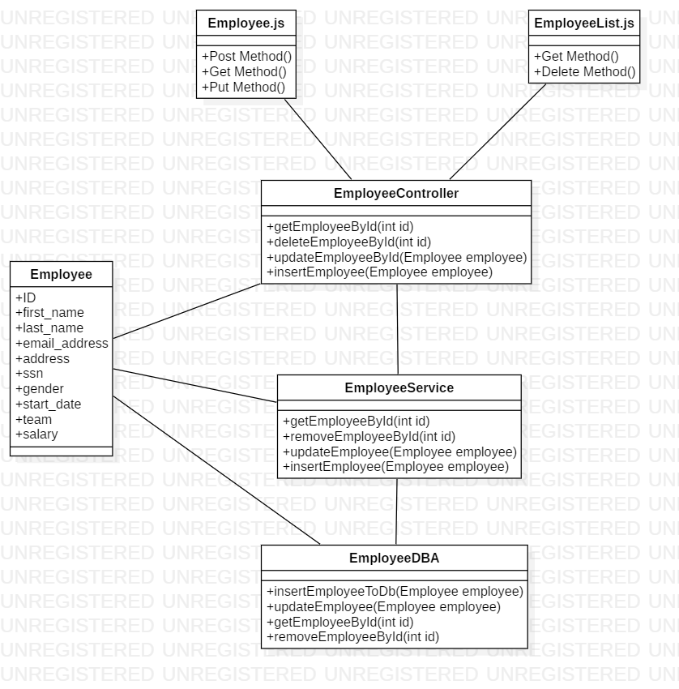
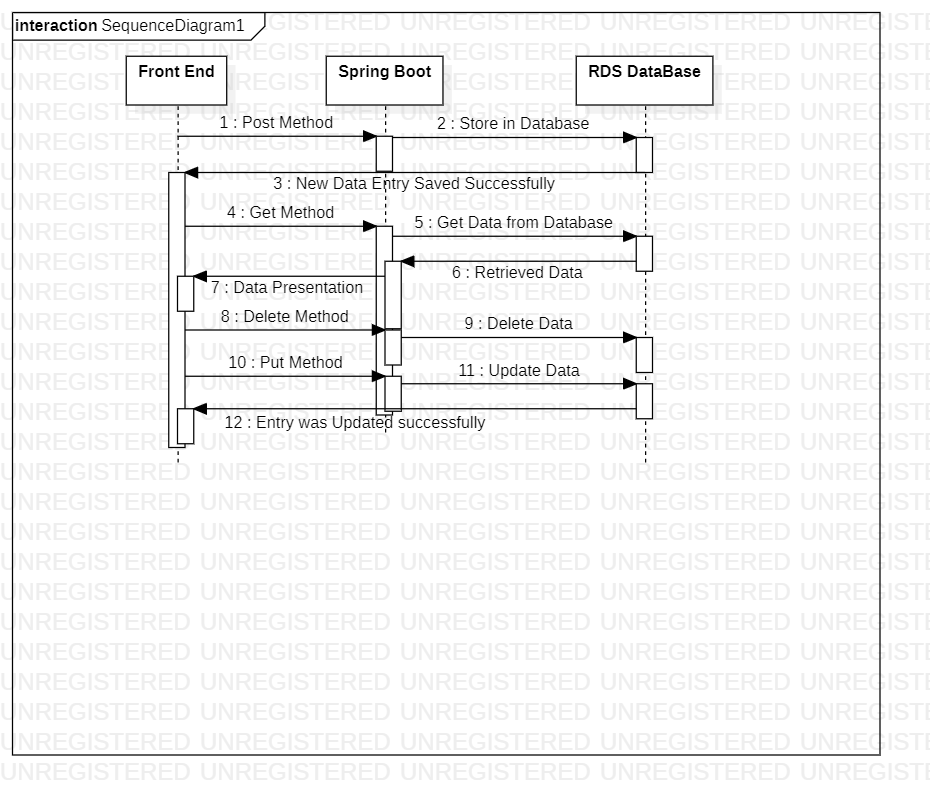

University Name: San Jose State University

Course:Enterprise Software - CMPE172/Spring2020

TeamMembers: Marcus Zhou, Jesscia Hoang, Braulio Mendoza

Project Introduction: Workforce data entry application which allows recruiter to enter new hire information into the system. The application also allows users to view and delete existing employee's data.

Any Pre-requisites for setup: 
-List of required software to download: NodeJS, Eclipse IDE, MySQL Workbench
	

Instructions on how to run the project locally: 
- Open Eclipse IDE
- Import Project as Maven Project
- Run SpringBoot Application
- Open Browser and go to Localhost:5000
	
Class Diagram

Sequence diagrams

Midtier APIs:
GET Method
DELETE Method
POST Method
PUT Method